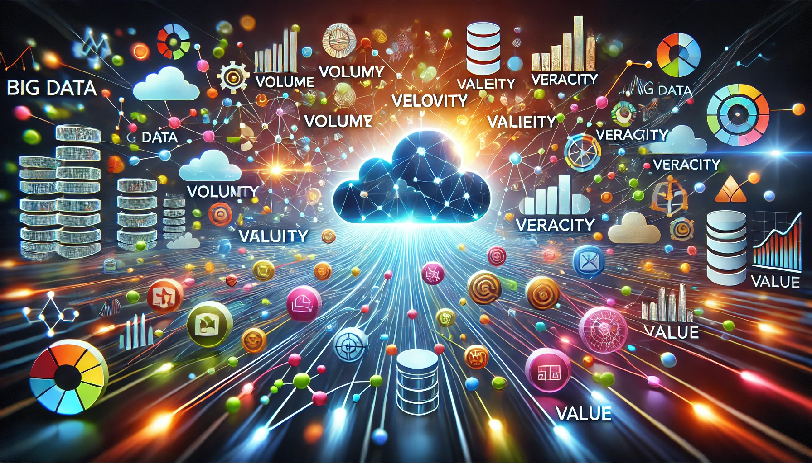

---
jupytext:
  formats: md:myst
  text_representation:
    extension: .md
    format_name: myst
kernelspec:
  display_name: Python 3
  language: python
  name: python3
---

# Dealing with Big Data

Big data is more than just large datasets; it's a revolution that challenges the way we think about data processing, storage, and analysis. Big data allows us to capture patterns, trends, and insights that were previously invisible, thereby enabling data-driven decision-making in industries ranging from healthcare to finance to entertainment. However, handling big data isn't easy; it presents a myriad of challenges involving storage, scalability, data processing, and even ethical concerns. In this section, we will explore strategies and technologies for handling big data efficiently.

## What is Big Data?

Big data refers to datasets that are so large and complex that traditional data processing tools become insufficient to handle them. The concept is often defined using the **3Vs**:

1. **Volume**: The sheer size of the data being generated and stored.
2. **Velocity**: The speed at which the data is generated and processed.
3. **Variety**: The different forms and sources of data, including structured, unstructured, and semi-structured data.

Other important characteristics of big data also include **Veracity** (quality of the data) and **Value** (insights derived from data).

To handle big data effectively, we need tools and strategies that scale with its growth, can process and analyze it efficiently, and can provide real-time insights. Let’s dive into a variety of these strategies with real-life examples, use cases, and interactive elements.



**Figure 1: Big Data Concept Illustration** - This illustration visualizes the interconnectedness of big data's 5Vs: Volume, Velocity, Variety, Veracity, and Value, demonstrating the complexity and the flow of vast information in a connected network.

## Strategies to Deal with Big Data

### 1. Distributed Computing
When dealing with big data, it's important to spread the load across multiple machines, also known as distributed computing. Instead of processing a large dataset on a single machine, tools like **Apache Hadoop** and **Apache Spark** split the data into manageable chunks that can be processed concurrently on multiple nodes. This reduces processing time significantly.

#### Hadoop and MapReduce
**Hadoop** is a distributed computing framework that uses the **MapReduce** paradigm to break down complex operations into smaller sub-tasks that can be distributed across multiple nodes. Here, the **Map** phase processes key-value pairs to generate intermediate results, and the **Reduce** phase aggregates these results.

```{code-cell}
from mrjob.job import MRJob

class MRWordCount(MRJob):
    def mapper(self, _, line):
        # Split each line into words and emit (word, 1) for each word
        for word in line.split():
            yield (word.lower(), 1)

    def reducer(self, key, values):
        # Sum the values for each word
        yield (key, sum(values))

if __name__ == '__main__':
    MRWordCount.run()
```


| Step          | Description                                      |
|---------------|--------------------------------------------------|
| **Map**       | Splits data into key-value pairs                 |
| **Shuffle**   | Redistributes data based on key values           |
| **Reduce**    | Aggregates the data for final output             |

### Spark and Resilient Distributed Datasets (RDDs)
**Apache Spark** is another distributed computing framework that has gained immense popularity. Unlike Hadoop, which relies on disk I/O for every operation, Spark keeps the data in memory (in the form of **Resilient Distributed Datasets**, or RDDs), making it far faster than Hadoop.

```{code-cell}
# Using PySpark for distributed data processing
from pyspark.sql import SparkSession

# Initialize a Spark session
spark = SparkSession.builder.appName("BigDataExample").getOrCreate()

# Load a CSV dataset into a DataFrame
df = spark.read.csv("hdfs://path_to_large_dataset.csv", header=True, inferSchema=True)

# Perform some distributed computations
result = df.groupBy("category").count()
result.show()
```


| Feature               | Hadoop MapReduce         | Apache Spark           |
|-----------------------|--------------------------|------------------------|
| **Processing Speed**  | Slow (Disk-Based I/O)    | Fast (In-Memory)       |
| **Ease of Use**       | Complex                  | User-Friendly          |
| **Data Storage**      | HDFS                     | In-Memory RDD          |

### 2. Data Partitioning and Storage Solutions

Handling big data also requires efficient storage strategies. Cloud storage platforms like **Amazon S3**, **Google Cloud Storage**, and **Azure Blob Storage** allow for scalable storage. Data partitioning is also a common technique, where large datasets are split into smaller, more manageable parts.

#### Parquet and ORC File Formats
For better storage efficiency, **Parquet** and **ORC** file formats are used to store data in a columnar fashion. These formats help in minimizing I/O operations and reducing storage footprint, making queries more efficient.

```{code-cell}
# Saving DataFrame in Parquet format
output_path = "hdfs://path_to_output_directory"
df.write.parquet(output_path)
```

| Format   | Description                                     | Use Case                                |
|----------|-------------------------------------------------|-----------------------------------------|
| **Parquet** | Columnar storage, optimized for analytical queries | Data analytics and machine learning     |
| **ORC**     | Highly efficient compression and storage      | Hadoop ecosystem and data warehousing   |

### 3. Batch vs Real-Time Processing

Big data often needs different approaches based on processing requirements:

- **Batch Processing**: Used for large-scale analytics that doesn't require real-time processing. Hadoop is commonly used for this purpose.
- **Real-Time Processing**: Used when immediate action is needed, e.g., in fraud detection. Tools like **Apache Kafka** and **Apache Flink** provide real-time data pipelines that enable streaming data analysis.

#### Real-Time Analytics with Kafka and Spark Streaming

Real-time processing enables real-time data ingestion, transformation, and analysis. One popular approach is using **Apache Kafka** for ingesting streams of data and **Apache Spark Streaming** for real-time analysis.

```{code-cell}
from pyspark.sql import SparkSession
from pyspark.streaming import StreamingContext

# Spark session for real-time processing
spark = SparkSession.builder.appName("RealTimeAnalytics").getOrCreate()
ssc = StreamingContext(spark.sparkContext, 10)  # 10-second batch intervals

# Stream data from Kafka
data_stream = ssc.socketTextStream("localhost", 9092)

# Process the data in real time
def process_data(time, rdd):
    print(f"Processing batch at {time}")
    print(rdd.collect())

data_stream.foreachRDD(process_data)

ssc.start()
ssc.awaitTermination()
```


| Component         | Description                                  |
|-------------------|----------------------------------------------|
| **Kafka**         | Message broker for real-time data ingestion  |
| **Spark Streaming** | Real-time computation framework            |

### 4. Data Reduction Techniques

Big data can be overwhelming, especially if your infrastructure is unable to keep up with the scale of processing required. Here, data reduction techniques like **sampling** and **dimensionality reduction** become crucial.

#### Sampling Data
**Sampling** is a data reduction technique used when the dataset is simply too large to process in its entirety. By extracting representative samples, you can gain insights without processing the entire dataset.

#### Dimensionality Reduction with PCA
**Principal Component Analysis (PCA)** is often used for dimensionality reduction to reduce the number of features in a dataset while maintaining its variability.

```{code-cell}
from sklearn.decomposition import PCA
from sklearn.datasets import make_classification

# Create a large synthetic dataset
X, _ = make_classification(n_samples=100000, n_features=50)

# Apply PCA to reduce the number of features to 10
pca = PCA(n_components=10)
X_reduced = pca.fit_transform(X)
```


| Technique            | Description                                | Use Case                   |
|----------------------|--------------------------------------------|----------------------------|
| **Sampling**         | Extract representative data samples        | Exploratory data analysis  |
| **PCA**              | Reduce dimensionality of data              | Machine learning, clustering|

### 5. Machine Learning with Big Data

Big data also opens doors for more complex **machine learning** models that can derive insights and predict future trends. However, training models on huge datasets can be extremely challenging. Here are some strategies to make machine learning feasible:

#### Stochastic Gradient Descent (SGD) for Large Datasets
Traditional gradient descent requires the entire dataset in memory, which is impractical for big data. Instead, **Stochastic Gradient Descent (SGD)** and **Mini-batch Gradient Descent** can be used.

```{code-cell}
import numpy as np

# Simulated dataset
X = np.random.randn(1000000, 10)
y = np.random.randn(1000000, 1)

mini_batch_size = 1000
learning_rate = 0.01

# Training loop using mini-batch gradient descent
for epoch in range(10):  # Number of epochs
    for i in range(0, X.shape[0], mini_batch_size):
        X_mini = X[i:i + mini_batch_size]
        y_mini = y[i:i + mini_batch_size]
        # Calculate gradient and update weights
        # weight_update = -learning_rate * gradient(X_mini, y_mini)
```

### 6. Model Parallelism and Distributed Training

When working with very large models, such as **Deep Learning** models, distributing model training across multiple GPUs is often required to speed up the training process.

```{code-cell}
import torch
import torch.nn as nn

# Example: Defining a model and splitting it across multiple GPUs
class LargeModel(nn.Module):
    def __init__(self):
        super(LargeModel, self).__init__()
        self.layer1 = nn.Linear(1000, 500).to('cuda:0')  # Place on GPU 0
        self.layer2 = nn.Linear(500, 100).to('cuda:1')   # Place on GPU 1

    def forward(self, x):
        x = self.layer1(x.to('cuda:0'))
        x = self.layer2(x.to('cuda:1'))
        return x

model = LargeModel()
```

### 7. Cloud Computing for Big Data

Cloud computing platforms such as **AWS**, **Google Cloud**, and **Microsoft Azure** offer scalable and cost-efficient solutions for managing and analyzing big data. They provide a wide range of services including distributed databases, data storage, analytics, and machine learning tools.

#### AWS Example - Amazon Redshift
**Amazon Redshift** is a cloud-based data warehouse that allows users to run complex SQL queries on large datasets efficiently.

```sql
-- SQL Query to analyze sales data in Redshift
SELECT product_id, SUM(sales) AS total_sales
FROM sales_data
GROUP BY product_id
ORDER BY total_sales DESC;
```


| Service           | Description                                   | Use Case                          |
|-------------------|-----------------------------------------------|-----------------------------------|
| **AWS Redshift**  | Scalable data warehousing and SQL analytics   | Business intelligence, reporting  |
| **Google BigQuery** | Serverless data warehouse for big data      | Ad-hoc querying, data exploration |

### 8. Graph-Based Data Models for Complex Relationships

Sometimes the relationships in big data are so intricate that a traditional table-based structure doesn't suffice. **Graph databases** like **Neo4j** allow us to store data in graph structures, making it easier to traverse relationships and perform complex queries.

```{code-cell}
from py2neo import Graph

# Connect to Neo4j graph database
graph = Graph("bolt://localhost:7687", auth=("neo4j", "password"))

# Create a new node in the graph
graph.run("CREATE (p:Person {name: 'John Doe', age: 29})")

# Query to find all people older than 25
result = graph.run("MATCH (p:Person) WHERE p.age > 25 RETURN p.name, p.age")
for record in result:
    print(record)
```


| Component         | Description                                      | Use Case                        |
|-------------------|--------------------------------------------------|---------------------------------|
| **Node**          | Represents an entity (e.g., Person, Product)     | Social networks, recommendations|
| **Relationship**  | Describes the connection between nodes          | Fraud detection, link analysis  |

### 9. Handling Unstructured Data

Big data isn’t always neat. Often, it includes **unstructured data** from sources like social media, images, and sensor readings. Tools like **Elasticsearch** and **Apache Solr** can be used to index and search unstructured data effectively.

```{code-cell}
from elasticsearch import Elasticsearch

# Connect to Elasticsearch
es = Elasticsearch(["http://localhost:9200"])

# Index a document
doc = {
    "author": "Mike",
    "text": "This is a sample document",
    "timestamp": "2024-01-01"
}
es.index(index="sample_index", id=1, document=doc)

# Search for documents
docs = es.search(index="sample_index", query={"match": {"author": "Mike"}})
print(docs)
```


| Tool               | Description                                      | Use Case                        |
|--------------------|--------------------------------------------------|---------------------------------|
| **Elasticsearch**  | Full-text search and analytics engine            | Log analysis, e-commerce search |
| **Apache Solr**    | Open-source search platform                      | Website search, data indexing   |

### 10. Ethical Considerations and Data Governance

Big data also brings with it ethical concerns regarding **privacy**, **security**, and **data ownership**. Ensuring data privacy is crucial, especially when dealing with personally identifiable information (PII). Regulatory frameworks like **GDPR** and **CCPA** have been established to ensure ethical handling of data.

**Table: Ethical Considerations in Big Data**

| Concern                | Description                                      | Regulation                      |
|------------------------|--------------------------------------------------|---------------------------------|
| **Privacy**            | Protection of personal information               | GDPR, CCPA                      |
| **Security**           | Measures to safeguard data                       | Encryption, access controls     |
| **Data Ownership**     | Rights over data collection and usage            | Consent-based data collection   |

